# ThechnicalTestNq
Datos históricos NBA

# Documentación del Proyecto: Arquitectura de Procesamiento de Datos con Azure, Jupyter Notebook y Power BI

## Descripción General
Esta solución fue desarrollada utilizando tecnologías de **Azure Data Lake**, **Azure Data Factory**, y **Jupyter Notebook**, emulando un comportamiento similar al que podría desarrollarse en **Databricks**. Además, **Power BI Desktop** se utilizó para disponibilizar las fuentes de datos y construir el modelo analítico. 

El proyecto emplea **Python** como lenguaje de programación principal, junto con librerías específicas de **PySpark** para el procesamiento distribuido.

---

## Fuente de Datos
El conjunto de datos fue extraído del repositorio público de **Kaggle Datasets** y consta de 5 archivos en formato CSV que contienen información sobre juegos de la **NBA (National Basketball Association)**. Estos archivos se almacenaron en un contenedor de **Azure Data Lake** denominado `nba`, se selecciono esta fuente debido a su facilidad para el entendimiento y exploración y de esta manera poder dedicar mayor tiempo a la solución del ejercicio.

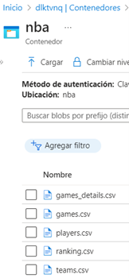

## Descripción de Fuentes

- **games.csv**: Todos los partidos desde la temporada 2004 hasta la última actualización, incluyendo la fecha, los equipos y algunos detalles como el número de puntos, etc.
- **games_details.csv**: Detalles del conjunto de datos de juegos, contiene todas las estadísticas de los jugadores para un juego determinado.
- **players.csv**: Datos de los jugadores (nombre).
- **ranking.csv**: Clasificación de la NBA para un día determinado, dividida en oeste y este en la columna `CONFERENCE`.
- **teams.csv**: Todos los equipos de la NBA.

## Diccionario de Datos

## Tabla `games`
| **Campo**           | **Descripción**                                                      | **Tipo de Dato** |
|----------------------|----------------------------------------------------------------------|------------------|
| `GAME_DATE_EST`      | Fecha del juego en formato EST.                                      | Date             |
| `GAME_ID`            | Identificador único del juego.                                      | Integer          |
| `GAME_STATUS_TEXT`   | Estado del juego (e.g., Final, En progreso).                        | String           |
| `HOME_TEAM_ID`       | Identificador del equipo local.                                     | Integer          |
| `VISITOR_TEAM_ID`    | Identificador del equipo visitante.                                 | Integer          |
| `SEASON`             | Temporada del juego.                                               | Integer          |
| `TEAM_ID_home`       | Identificador del equipo local.                                     | Integer          |
| `PTS_home`           | Puntos anotados por el equipo local.                                | Integer          |
| `FG_PCT_home`        | Porcentaje de tiros de campo del equipo local.                      | Float            |
| `FT_PCT_home`        | Porcentaje de tiros libres del equipo local.                        | Float            |
| `FG3_PCT_home`       | Porcentaje de tiros de tres del equipo local.                       | Float            |
| `AST_home`           | Asistencias realizadas por el equipo local.                        | Integer          |
| `REB_home`           | Rebotes tomados por el equipo local.                               | Integer          |
| `TEAM_ID_away`       | Identificador del equipo visitante.                                 | Integer          |
| `PTS_away`           | Puntos anotados por el equipo visitante.                           | Integer          |
| `FG_PCT_away`        | Porcentaje de tiros de campo del equipo visitante.                 | Float            |
| `FT_PCT_away`        | Porcentaje de tiros libres del equipo visitante.                   | Float            |
| `FG3_PCT_away`       | Porcentaje de tiros de tres del equipo visitante.                  | Float            |
| `AST_away`           | Asistencias realizadas por el equipo visitante.                    | Integer          |
| `REB_away`           | Rebotes tomados por el equipo visitante.                           | Integer          |
| `HOME_TEAM_WINS`     | Indica si el equipo local ganó (1: sí, 0: no).                     | Boolean          |

---

## Tabla `games_details`
| **Campo**           | **Descripción**                                                      | **Tipo de Dato** |
|----------------------|----------------------------------------------------------------------|------------------|
| `GAME_ID`            | Identificador único del juego.                                      | Integer          |
| `TEAM_ID`            | Identificador único del equipo.                                     | Integer          |
| `TEAM_ABBREVIATION`  | Abreviatura del equipo.                                             | String           |
| `TEAM_CITY`          | Ciudad del equipo.                                                  | String           |
| `PLAYER_ID`          | Identificador único del jugador.                                    | Integer          |
| `PLAYER_NAME`        | Nombre completo del jugador.                                        | String           |
| `NICKNAME`           | Apodo del jugador.                                                 | String           |
| `START_POSITION`     | Posición inicial del jugador.                                       | String           |
| `COMMENT`            | Comentarios adicionales sobre el jugador.                          | String           |
| `MIN`                | Minutos jugados.                                                   | String           |
| `FGM`                | Tiros de campo encestados.                                          | Float            |
| `FGA`                | Tiros de campo intentados.                                          | Float            |
| `FG_PCT`             | Porcentaje de tiros de campo encestados.                           | Float            |
| `FG3M`               | Tiros de tres puntos encestados.                                   | Float            |
| `FG3A`               | Tiros de tres puntos intentados.                                   | Float            |
| `FG3_PCT`            | Porcentaje de tiros de tres encestados.                            | Float            |
| `FTM`                | Tiros libres encestados.                                           | Float            |
| `FTA`                | Tiros libres intentados.                                           | Float            |
| `FT_PCT`             | Porcentaje de tiros libres encestados.                             | Float            |
| `OREB`               | Rebotes ofensivos.                                                 | Float            |
| `DREB`               | Rebotes defensivos.                                                | Float            |
| `REB`                | Rebotes totales.                                                  | Float            |
| `AST`                | Asistencias realizadas.                                            | Float            |
| `STL`                | Robos de balón realizados.                                         | Float            |
| `BLK`                | Bloqueos realizados.                                               | Float            |
| `TO`                 | Pérdidas de balón.                                                | Float            |
| `PF`                 | Faltas personales.                                                 | Float            |
| `PTS`                | Puntos anotados.                                                  | Float            |
| `PLUS_MINUS`         | Estadística +/- del jugador en el juego.                           | Float            |

---

## Tabla `players`
| **Campo**      | **Descripción**                         | **Tipo de Dato** |
|-----------------|-----------------------------------------|------------------|
| `PLAYER_NAME`  | Nombre completo del jugador.            | String           |
| `TEAM_ID`      | Identificador único del equipo.         | Integer          |
| `PLAYER_ID`    | Identificador único del jugador.        | Integer          |
| `SEASON`       | Temporada en la que jugó el jugador.    | Integer          |

---

## Tabla `ranking`
| **Campo**       | **Descripción**                                 | **Tipo de Dato** |
|------------------|-------------------------------------------------|------------------|
| `TEAM_ID`       | Identificador único del equipo.                 | Integer          |
| `LEAGUE_ID`     | Identificador único de la liga.                 | Integer          |
| `SEASON_ID`     | Identificador único de la temporada.            | Integer          |
| `STANDINGSDATE` | Fecha de la clasificación.                      | Date             |
| `CONFERENCE`    | Conferencia a la que pertenece el equipo.       | String           |
| `TEAM`          | Nombre del equipo.                              | String           |
| `G`             | Número de juegos jugados.                       | Integer          |
| `W`             | Número de juegos ganados.                       | Integer          |
| `L`             | Número de juegos perdidos.                      | Integer          |
| `W_PCT`         | Porcentaje de juegos ganados.                   | Float            |
| `HOME_RECORD`   | Récord de juegos en casa.                       | String           |
| `ROAD_RECORD`   | Récord de juegos como visitante.                | String           |
| `RETURNTOPLAY`  | Indica si el equipo regresó a jugar.            | String           |

---

## Tabla `teams`
| **Campo**           | **Descripción**                               | **Tipo de Dato** |
|----------------------|-----------------------------------------------|------------------|
| `LEAGUE_ID`          | Identificador único de la liga.              | Integer          |
| `TEAM_ID`            | Identificador único del equipo.              | Integer          |
| `MIN_YEAR`           | Año mínimo en el que el equipo participó.    | Integer          |
| `MAX_YEAR`           | Año máximo en el que el equipo participó.    | Integer          |
| `ABBREVIATION`       | Abreviatura del equipo.                      | String           |
| `NICKNAME`           | Apodo del equipo.                            | String           |
| `YEARFOUNDED`        | Año de fundación del equipo.                 | Integer          |
| `CITY`               | Ciudad del equipo.                           | String           |
| `ARENA`              | Nombre de la arena donde juega el equipo.    | String           |
| `ARENACAPACITY`      | Capacidad de la arena.                       | Integer          |
| `OWNER`              | Propietario del equipo.                      | String           |
| `GENERALMANAGER`     | Gerente general del equipo.                  | String           |
| `HEADCOACH`          | Entrenador principal del equipo.             | String           |
| `DLEAGUEAFFILIATION` | Afiliación de la liga de desarrollo.         | String           |


---

## ¿Qué problemas podría resolver esta solución?

La solución resuelve varios problemas relacionados con el análisis y manejo de datos históricos y en tiempo real de la NBA:

- **Consolidación y análisis de datos históricos:** Integra múltiples conjuntos de datos (partidos, estadísticas de jugadores, rankings, equipos, etc.) para permitir un análisis completo y contextualizado de las temporadas de la NBA desde 2004.
- **Seguimiento del rendimiento de jugadores y equipos:** Facilita el análisis detallado de las estadísticas individuales y grupales para evaluar desempeño, identificar patrones, y realizar comparaciones históricas.
- **Exploración de tendencias y correlaciones:** Permite analizar cómo variables como los rankings, los puntajes de juegos, y el rendimiento de los jugadores afectan los resultados de los equipos a lo largo de las temporadas.
- **Acceso eficiente a datos complejos:** Organiza grandes volúmenes de datos en una estructura manejable y optimizada, asegurando que las consultas y análisis puedan realizarse de manera eficiente incluso con datasets grandes.
- **Toma de decisiones basada en datos:** Responde a las necesidades de usuarios finales que buscan información relevante para predicciones, estrategias deportivas, o investigaciones relacionadas con la NBA.

## ¿Qué beneficios aporta a la organización o usuarios finales?

- **Acceso a datos ricos y relevantes:** Los usuarios tienen acceso a datos limpios, estructurados y enriquecidos sobre la NBA, lo que facilita realizar análisis desde el nivel más básico hasta insights avanzados.
- **Información estratégica:** Los equipos técnicos, analistas deportivos, y fanáticos pueden tomar decisiones mejor informadas, ya sea para diseñar estrategias de juego, pronósticos de rendimiento o estudios históricos.
- **Eficiencia en el análisis:** La solución está diseñada para manejar grandes volúmenes de datos y realizar consultas complejas de manera eficiente, reduciendo tiempos de espera para obtener resultados.
- **Personalización y profundidad del análisis:** Los usuarios pueden analizar información específica, como estadísticas individuales de jugadores, impacto del ranking en los resultados de los juegos, o comparaciones entre equipos.
- **Predicciones y análisis de tendencias:** Al consolidar datos históricos y actuales, la solución permite identificar patrones y tendencias que podrían usarse para predicciones futuras, como desempeño de equipos o rankings esperados.
- **Mejora de experiencias para audiencias amplias:** Ya sea que los usuarios sean aficionados, medios de comunicación, equipos de la NBA o empresas, la solución entrega información valiosa que puede ser usada para narrativas, reportajes o estrategias comerciales.

---

## Arquitectura de la Solución
La arquitectura sigue el enfoque **Medallion** (Medallón), ampliamente adoptado en diseños **Lakehouse**. 
Más información sobre esta arquitectura se puede consultar en [Documentación Oficial de Microsoft](https://learn.microsoft.com/es-es/azure/databricks/lakehouse/medallion-architecture).

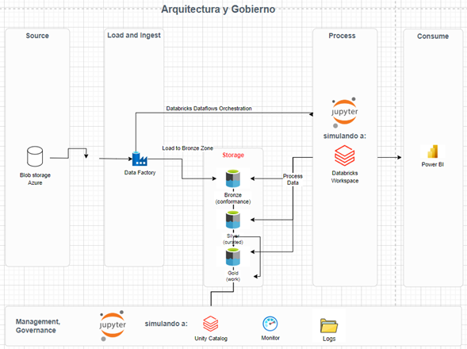

---

## Configuración de Azure Data Factory

### 1. Configuración Inicial
- **Linked Service:** Se creó un servicio vinculado para conectar **Data Factory** con **Blob Storage**.
- **Datasets:** Se implementaron cuatro datasets:
  - Dos para la fuente inicial (`nba`).
  - Dos para la capa `landing`.

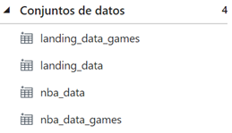

> **Nota:** Se utilizó el formato **Parquet** para los datasets, aprovechando ventajas como compresión integrada, rendimiento optimizado y eficiencia en el procesamiento, especialmente útil en entornos **Big Data**.

---

### 2. Flujo de Datos (Dataflow)
Se diseñó un **Dataflow** para transformar la fuente `games`:

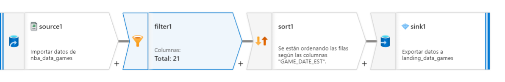

1. **Filtrado:** Filtrar la columna `GAME_DATA_SET`.

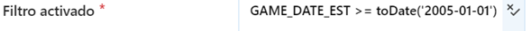

2. **Ordenamiento:** Ordenar los datos de manera ascendente por la misma columna.
3. **Carga:** Almacenar los datos transformados en el contenedor `landing`.

---

### 3. Pipelines
Se implementaron dos **pipelines**:
- Uno para ejecutar el **Dataflow**.
- Otro para mover datos desde el contenedor `nba` hacia la capa `landing`.

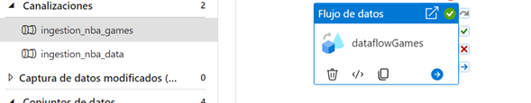

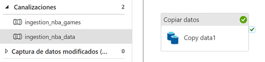

El pipeline `ingestión_nba_data` está parametrizado para recibir el nombre de la fuente deseada, asegurando flexibilidad en la ejecución.

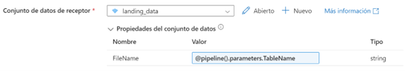

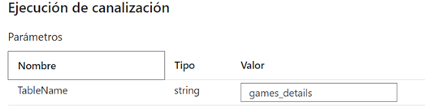

---

## Procesamiento con Jupyter Notebook
La herramienta **Jupyter Notebook** se utilizó para simular operaciones propias de **Databricks**, organizando el proyecto en carpetas según la estructura **Medallion**:

### Estructura de Carpetas
```plaintext
├── ingest_layer/
│   ├── conformance/
│   ├── curated/
├── business_layer/
│   ├── work/
├── catalogo/
│   ├── bronze/
│   ├── silver/
│   ├── gold/
```

## Proceso de Conformance y Curated

A partir de este punto se hace uso de Jupyter Notebook como principal herramienta, emulando en la medida posible lo que podríamos hacer con Databricks.

# Estructura de Carpetas

- Se construye la siguiente estructura de folders:
  
- El folder **`ingest_layer`** contiene los notebooks correspondientes a **`conformance`** y **`curated`**:

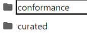

- **`business_layer`** contiene los notebooks correspondientes a la capa **`work`**:

- 

- En cada una de las carpetas de las **capas** se encuentran los notebooks para cada archivo y una carpeta **`logs`** donde se registran las excepciones, errores y procesos exitosos:

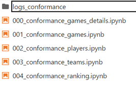

- El folder **`catalogo`** simula lo que sería un catálogo de Databricks, en el cual se van almacenando las fuentes en las diferentes capas:

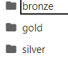

### Conformance Layer
En esta fase, el propósito principal de los notebooks es:

1. **Lectura de Datos:** Leer los archivos directamente del Data Lake.

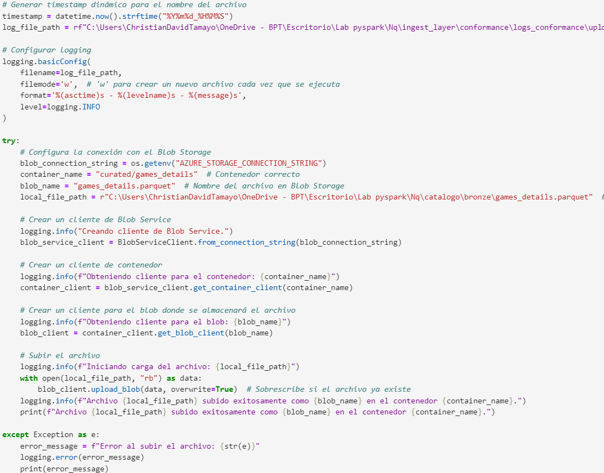

> **Nota:** Se encriptan las credenciales con el uso de "os".
3. **Definición de Esquema:** Establecer un esquema fijo, definiendo los tipos de datos más adecuados para cada variable.

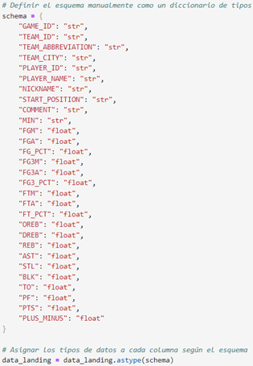

4. **Renombramientos:** Realizar un ejercicio de renombramientos si aplica.

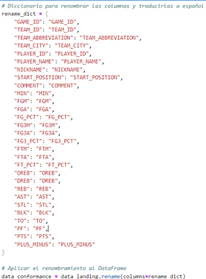

Ejemplo del procesamiento en la capa **Conformance**:

- Se lee el archivo del contenedor correspondiente.
- Se define un esquema fijo para la tabla.
- Se registran logs con detalles de las ejecuciones exitosas y errores.

```plaintext
Estructura de Logs:
- Hora de ejecución
- Resultado del proceso
- Detalle de errores
```
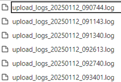

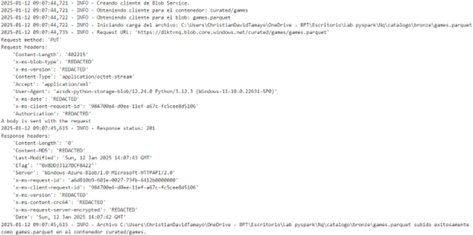

A continuación, los datos procesados se escriben en la capa **Curated** del Data Lake.

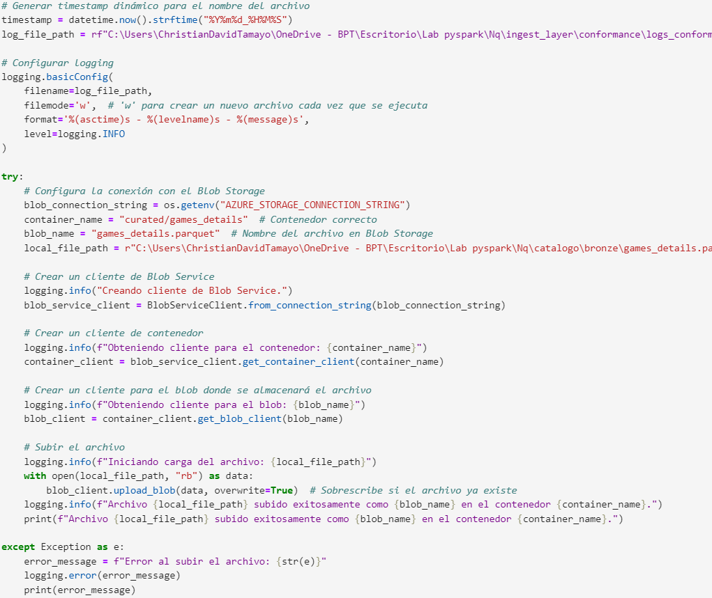

## Curated Layer
El propósito de los notebooks en la capa **Curated** es garantizar la limpieza y calidad de los datos. Se aplican reglas específicas para transformar y depurar las fuentes antes de moverlas a la siguiente capa (**Work**).

### Ejemplo de Transformaciones:

1. **Transformaciones Generales:**
   - Para todas las fuentes, se convierten las cadenas de texto a mayúsculas.
   - Eliminación de duplicados.
     
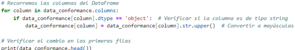

2. **Tabla `games`:**
   - Se eliminan duplicados en la columna `GAME_ID`.
  
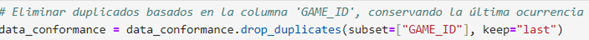

   - Se extraen las columnas `YEAR`, `MONTH` y `DAY` de la columna `GAME_DATE_EST`.

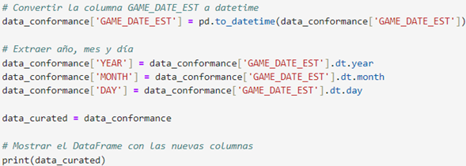

3. **Tabla `games_details`:**
   - Limpieza de la columna `MIN` (minutos de juego):
     - Valores no numéricos se reemplazan por `NaN` utilizando `numpy`.
     - Conversión de la columna a tipo `float`.
     - Creación de una nueva columna derivada llamada `MINFLOAT`, que será utilizada para construir medidas calculadas.

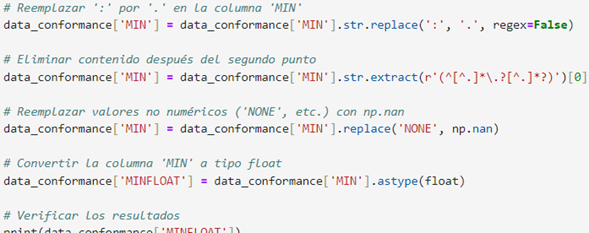

4. **Otras Transformaciones:**
   - Las transformaciones específicas de las demás fuentes están documentadas en los notebooks correspondientes.

### Resultado del Proceso
- Los datos procesados se escriben tanto en la **zona Silver** del catálogo como en el Data Lake, dentro de la carpeta **Curated**.

---

## Work Layer
En la capa **Work**, se aplican reglas de negocio y operaciones necesarias para consolidar los datos en tablas de dimensiones y hechos listas para el consumo.

### Actividades Principales:
1. **Definición de Reglas de Negocio:**
   - Se crean columnas calculadas adicionales según los requerimientos del modelo de datos.

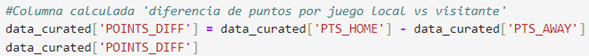

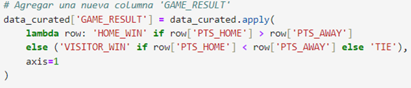

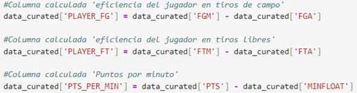

2. **Uniones y Consolidación:**
   - Se relacionan datos entre tablas para formar dimensiones y tablas de hechos.

### Resultado del Proceso:
- Las tablas procesadas son escritas en la **capa Gold** del catálogo y en el Data Lake, dentro de la carpeta **Work**.

---

## Consumo en Power BI Desktop
En esta última etapa, se conectan las tablas procesadas en la capa **Work** a Power BI Desktop para construir el modelo de datos y facilitar su análisis.

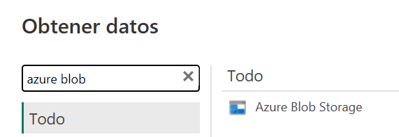

### Modelo de Datos en Power BI
- **Estructura del Modelo:**
  - Tablas de hechos: `FactGamesDetails`, `FactGames`, `FactRanking`.
  - Dimensiones: `DimTeams`, `DimPlayers`.

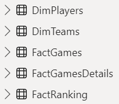

- **Optimización del Modelo:**
  - Se establecen relaciones entre las tablas.
  - Se crean medidas calculadas para facilitar el análisis.

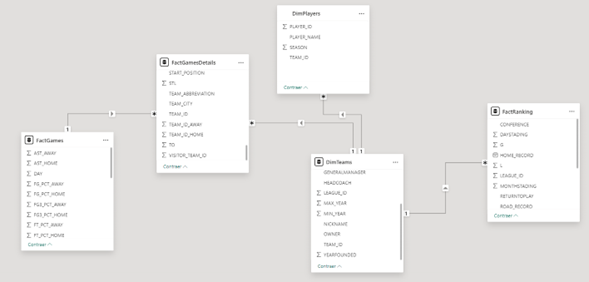

### Visualización
- El modelo diseñado permite ser utilizado para obtener insights clave sobre los datos de la NBA mediante dashboards y reportes interactivos.

---

## Conclusión
Esta solución demuestra cómo aplicar una arquitectura de medallones para procesar y consumir datos de manera eficiente, utilizando tecnologías modernas como **Azure Data Factory**, **Azure Data Lake**, y **Jupyter Notebook**. La integración final con **Power BI Desktop** asegura que los datos sean confiables, escalables y estén listos para análisis avanzados.

### Recursos Adicionales
- [Documentación de Arquitectura de Medallones - Microsoft Learn](https://learn.microsoft.com/es-es/azure/databricks/lakehouse/medallion-architecture)
- Capturas y logs detallados están disponibles en el repositorio del proyecto para referencias adicionales.
- Usar procesamiento incremental (e.g., Change Data Capture o Delta Lake) en lugar de procesar datos completos diariamente.

## Escenarios de riesgo y posibles mitigaciones

### **Si los datos se incrementaran en 100x.**:
- Migrar a un sistema distribuido como Apache Spark y/o utilizar tecnologías Databricks para manejar el procesamiento de grandes volúmenes de datos
- Implementar almacenamiento en la nube como Amazon S3, Azure Data Lake o Google Cloud Storage, que son altamente escalables.
- Particionar las tablas por las columnas más utilizadas en los filtros (p. ej., fecha, región) y aplicar compresión como Parquet o Avro para optimizar el almacenamiento y la lectura.

###  Si las tuberías se ejecutaran diariamente en una ventana de tiempo especifica:
- Dividir los pipelines en procesos prioritarios y secundarios para optimizar el tiempo.
- Utilizar herramientas como Apache Spark en modo cluster con procesamiento distribuido.
- Realizar ETL en pequeñas cargas incrementales (micro-batches) para reducir el tiempo de procesamiento.

###  Si la base de datos necesitara ser accedido por más de 100 usuarios funcionales:
- Configurar réplicas de lectura en la base de datos para distribuir la carga entre múltiples nodos.
- Usar caché en memoria para consultas frecuentes o repetitivas.
- Implementar políticas de acceso basadas en roles (RBAC) para priorizar a ciertos usuarios según sus necesidades funcionales.

###  Si se requiere hacer analítica en tiempo real, ¿cuales componentes cambiaria a suarquitectura propuesta?:
- Utilizar herramientas de streaming como Apache Kafka para ingestión de datos y Apache Spark Streaming, Flink o Azure Stream Analytics para procesarlos.
- Integrar herramientas como Power BI con DirectQuery, Tableau o Grafana para visualización dinámica.
- Usar un clúster autoscalable que aumente recursos bajo demanda para manejar picos de datos.
